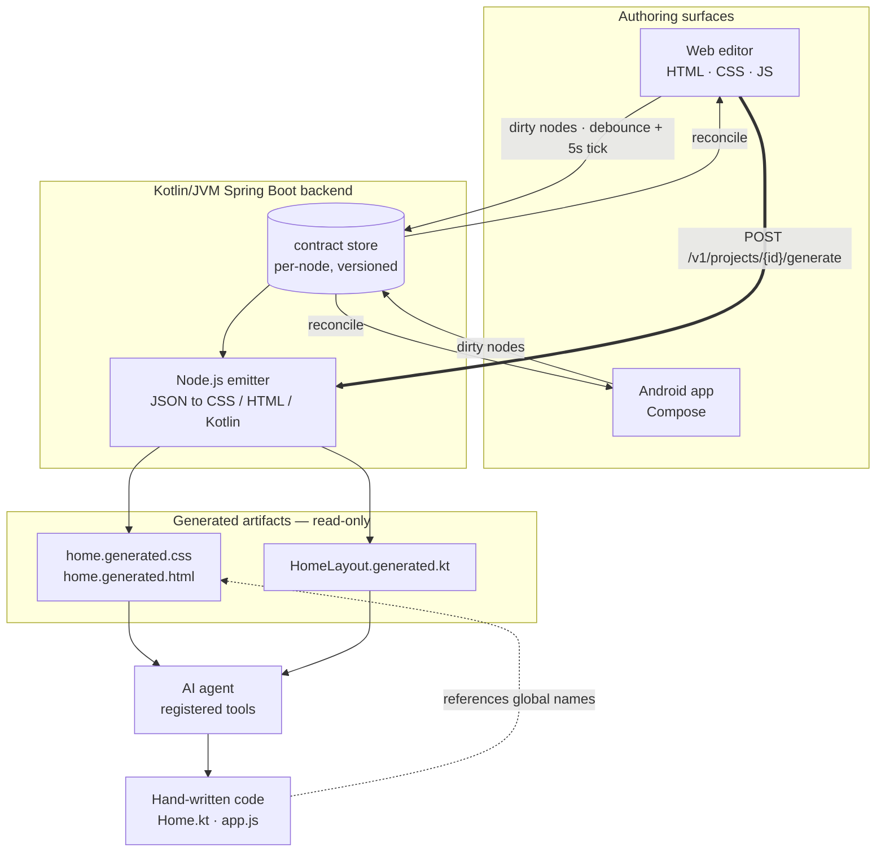
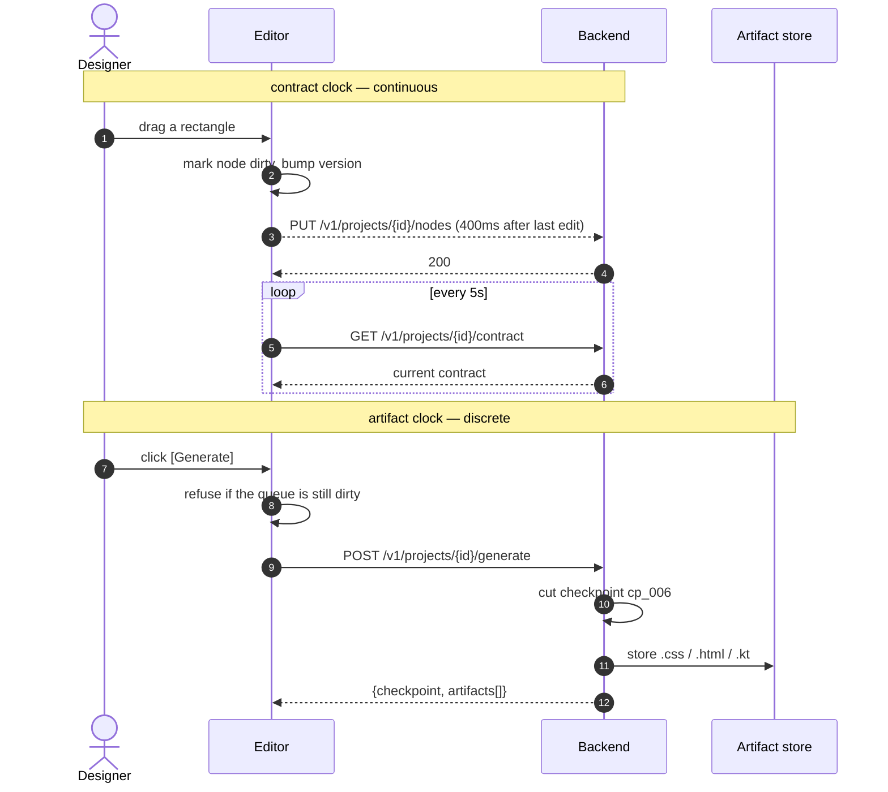

# IKK

A design tool whose output is a **contract**, not a picture.

A designer draws a screen. A developer gets `.css` and `.kt` generated from the
same JSON the designer was editing. Neither hands the other a file — they hold
two views of one object.

Hackathon scope: a browser editor and an Android/Compose client target one JSON
contract. A Kotlin/JVM Spring Boot backend reuses the Kotlin contract package,
persists it in H2 or PostgreSQL, and invokes one deterministic Node.js emitter
for Web CSS/HTML and Android Compose Kotlin. No model call is needed to convert
the contract into code.

## Where this stands

| Area | State |
|---|---|
| JSON contract (`packages/design-contract`) | Kotlin model reused directly by the backend; fixture suite green |
| Deterministic codegen (`packages/codegen`) | Implemented — emits `.kt`, `.css`, and structure-only `.html` |
| Backend (`apps/backend`) | Kotlin/Spring Boot; JDBC + Flyway; H2/PostgreSQL; sync, checkpoints, assets, generation |
| Android application | Hello World scaffold |
| Web application | Interactive editor in `apps/web` |
| Sync | Backend node API implemented; Web uses debounced contract sync; Android integration remains |

Authority order is in [docs/README.md](docs/README.md): the JSON contract wins
over the component model, the roadmap, and the prototypes.

---

## Why a contract and not an export

Design handoff loses information because the two sides hold different objects.
The designer holds a canvas; the developer holds code; a PNG or a spec document
sits between them and goes stale the moment either side moves.

IKK removes the document in the middle. There is one object — a JSON contract
of positioned, styled nodes — and everything else is a projection of it:

| Projection | Produced by | Editable by hand |
|---|---|---|
| Editor canvas | the editor, live from the contract | — (you edit the contract through it) |
| `home.generated.css` / `.html` | static emitter | **no** |
| `HomeLayout.generated.kt` | static emitter | **no** |
| `Home.kt`, `app.js` — behaviour | a human or an agent | yes |

The contract is normative and specified in
[`docs/json_contract.md`](docs/json_contract.md). If an implementation
disagrees with that file, the implementation is wrong.

---

## Pipeline



---

## Two clocks

The load-bearing decision in this design is that **syncing and generating are
driven by different triggers**.

| | Contract clock | Artifact clock |
|---|---|---|
| Trigger | an edit | the `[Generate]` button |
| Cadence | debounce ~400 ms, reconcile every 5 s | only when a human asks |
| Granularity | one node | the whole screen, plus a checkpoint |
| Writes | versioned node rows | immutable checkpoint + generated artifact records |
| If it goes wrong | stale canvas, fixed by the next tick | wrong code committed |

If the 5-second tick also generated code, every keystroke would cut a
checkpoint and rewrite files underneath whoever was editing them. Generation
has to be an *act*, not a side effect.



**Why `[Generate]` is blocked on a clean queue:** if it fires while nodes are
still in flight, the backend generates from a contract that is behind the
screen. The user sees output that does not match their canvas and reports it as
the generator being broken, when it is a sync bug. One boolean prevents an hour
of debugging the wrong thing.

### Why not cron

`cron` cannot express 5 seconds — its floor is one minute. What the sync needs
is two client-side policies, not a scheduler:

- **Debounce (~400 ms after the last edit)** — this is what makes it feel live.
- **Interval reconcile (5 s)** — a safety net that catches dropped pushes and
  pulls the other surface's changes.

A bare 5-second poll with no debounce is the worst of both: up to 5 s of
latency on your own edit, and a request every 5 s from an idle tab.

---

## The generate route

```http
POST /v1/projects/{id}/generate
Content-Type: application/json

{ "targets": ["css", "html", "kotlin"] }
```

```json
{
  "checkpoint": "cp_006",
  "artifacts": [
    { "name": "home.generated.css", "target": "css", "bytes": 920 },
    { "name": "home.generated.html", "target": "html", "bytes": 480 },
    { "name": "HomeLayout.generated.kt", "target": "kotlin", "bytes": 1840 }
  ]
}
```

`POST`, not `GET` — it cuts a checkpoint and stores newly generated artifacts.
That is a mutation with side effects, so browser prefetching must not trigger it.

The backend invokes `packages/codegen`; it does not implement a second emitter.
Both clients therefore receive output from the same deterministic implementation.

---

## What the emitter produces

One contract node, two targets. Full worked example in
[`docs/json_contract.md` §14](docs/json_contract.md).

```json
"text_2": {
  "id": "n2", "type": "text", "z": 1,
  "rect": { "x": 7.5, "y": 11.1, "w": 69.3, "h": 5.1, "unit": "%" },
  "fill": null,
  "text": { "value": "Good morning", "size": 26, "color": "#FFFFFF",
            "align": "start", "weight": "semibold" },
  "version": 7
}
```

```css
/* GENERATED FROM contract cp_006 — DO NOT EDIT */
.text_2 {
  left: 7.5%; top: 11.1%; width: 69.3%; height: 5.1%;
  color: #FFFFFF; font-size: 26px; font-weight: 600;
  line-height: 1.3; text-align: left;
}
```

```kotlin
// GENERATED FROM contract cp_006 — DO NOT EDIT
Box(Modifier.rel(0.075f, 0.111f, 0.693f, 0.051f),
    contentAlignment = Alignment.CenterStart) {
  Text("Good morning", color = Color(0xFFFFFFFF),
       fontSize = 26.sp, fontWeight = FontWeight.SemiBold)
}
```

Geometry is **relative** — fractions of the reference viewport, never pixels.
One contract lays out at any screen size, which is the only reason the same
numbers can drive a CSS percentage and a Compose `BoxWithConstraints` without a
per-device table.

---

## Global names are the join key

The map key in the contract — `rect_signIn`, `text_greeting` — becomes the CSS class *and*
the Compose identifier. That name is the entire connection between the
designer's rectangle and the developer's code.

```
contract key   rect_signIn
     ├── CSS        .rect_signIn
     └── Kotlin     HomeLayout, node index 0
```

Two consequences, both deliberate:

1. **The id is stable; the key is derived.** A node's `id` carries sync identity.
   Its `{type}_{slug(name)}` map key is used by codegen and changes on rename;
   generated files are replaced together, so those names stay aligned.
2. **Generated files are never hand-edited.** They are rewritten wholesale on
   every `[Generate]`. Behaviour lives in a sibling file that imports the
   generated names, so regeneration can never destroy authored code.

---

## Where the AI agent fits

The agent does not look at a screenshot and guess at a layout. It receives
**typed input**: a contract it can parse and generated files with known names.
Its job is wiring behaviour onto fixed geometry — a far smaller and far more
reliable problem than "build the UI".

| Tool | Returns |
|---|---|
| `read_contract(screen)` | the contract JSON — node ids, types, geometry, text |
| `list_artifacts(checkpoint)` | generated file paths and the global names in them |
| `write_impl(path, source)` | writes a hand-written sibling; refuses any `*.generated.*` path |

The refusal in `write_impl` is the whole safety model. The generated/authored
boundary is enforced by the tool, not by asking the agent nicely.

---

## Scope

Targets are fixed. This is not a plugin system.

| | In | Out |
|---|---|---|
| Web output | HTML + CSS (+ JS for behaviour) | React, Tailwind, SCSS |
| Android output | Kotlin + Compose | XML layouts, Views |
| Node types | rect, ellipse, text, image | groups, components, variants |
| Layout | relative geometry only | flex, constraints, auto-layout |
| Sync | per-node monotonic versions (higher version wins) | operational transform, CRDTs, presence |
| Data | one screen per project, H2/PostgreSQL, optional bearer token | roles, CRDTs, hosted multi-tenancy |

Cut order if time runs out, from [`docs/roadmap.md`](docs/roadmap.md) — each
line is still a demonstrable product:

1. Sync → manual export/import of the contract file
2. Android *editing* → Android as a read-only renderer (still proves one
   contract, two surfaces)
3. Backend → codegen in the web client, contract in `localStorage`
4. `image`, then `ellipse`

**Never cut:** the round-trip test on the contract, the pixel-parity goldens
between surfaces, and the generated/authored file boundary.

---

## Repo layout

```text
apps/
  backend/                 Kotlin/JVM Spring Boot API
  web/                     browser editor
  android/app/             Compose application
  android/data/            Android data layer
packages/
  design-contract/         shared Kotlin contract and validation
  codegen/                 deterministic CSS, HTML, and Compose emitter
docs/                      contract, API, architecture, and roadmaps
.github/workflows/         CI split by product concern
```

The backend and contract are both Kotlin/JVM. The backend consumes
`:packages:design-contract` directly, so there is no Java mirror that can drift.
Kotlin compiles to ordinary JVM bytecode and remains callable from Java if a
future JVM consumer needs it.

## Build and run

Requirements: JDK 21 for the backend, Node.js 18+, and the checked-in Gradle
wrapper. Android work additionally needs Android SDK API 37; its modules use a
Java 17 toolchain.

- JDK 17; Gradle toolchains can provision it automatically
- Android SDK with API 37 installed
- Gradle 9.6.1 through the checked-in wrapper

No JDK is pinned. Each module declares `jvmToolchain(17)` and the foojay
resolver in `settings.gradle.kts` fetches a matching JDK, so the build works on
a fresh clone. The SDK path is read from `local.properties` (`sdk.dir`), which
is git-ignored and must exist locally.

### Modules

Dependencies point downward only. Nothing below reaches up.

```text
app  ──>  data  ──>  core
```

| Module | Plugin | Purpose |
|---|---|---|
| `app` | `com.android.application` | Activity, Compose UI, dependency wiring |
| `data` | `com.android.library` | Repositories and data sources |
| `core` | `org.jetbrains.kotlin.jvm` | Pure logic. No Android dependency |

`core` applies no Android plugin, so `android.*` is not on its compile
classpath — a layering violation is a build failure, not a review comment. Its
tests run on the desktop JVM in well under a second.

`data` exposes `core` with `api(project(":core"))`, so `app` sees both through
one dependency.

Feature modules get added alongside `app` when there are features. None exist
yet, so none are declared.

### Components

#### Build

| File | Role |
|---|---|
| `settings.gradle.kts` | Declares the three modules and the repositories |
| `build.gradle.kts` | Declares plugins for subprojects, applies none itself |
| `gradle/libs.versions.toml` | Single source of versions for plugins and libraries |
| `gradle.properties` | JDK pin, JVM args, AndroidX flag |
| `app/build.gradle.kts` | `compileSdk 37`, `minSdk 26`, `targetSdk 36`, Compose on |
| `data/build.gradle.kts` | Android library, `compileSdk 37`, `minSdk 26` |
| `core/build.gradle.kts` | Kotlin/JVM targeting Kotlin 17 bytecode |

Kotlin sources live in `src/<set>/kotlin`, not the Android default
`src/<set>/java`. Each Android module's `sourceSets` block sets that.

#### `core`

| File | Role |
|---|---|
| `com/ikk/core/Greeting.kt` | `greeting(name): String` — pure, the one piece of real logic |
| `com/ikk/core/GreetingTest.kt` | Unit test for it |

#### `data`

| File | Role |
|---|---|
| `com/ikk/data/GreetingRepository.kt` | `GreetingRepository` interface and `DefaultGreetingRepository`, which delegates to `core` |
| `com/ikk/data/GreetingRepositoryTest.kt` | Unit test for the delegation |

The repository is a seam, not yet an abstraction that earns its keep. If no
real data source ever lands here, fold it into `app`.

#### `app`

| File | Role |
|---|---|
| `com/ikk/MainActivity.kt` | `ComponentActivity`, constructs the repository, sets the Compose content |
| `com/ikk/ui/GreetingScreen.kt` | Stateless composable taking the message as a parameter, plus its `@Preview` |
| `AndroidManifest.xml` | Declares `MainActivity` as the launcher activity |
| `res/values/strings.xml` | `app_name` |
| `res/values/themes.xml` | `Theme.IKK`, a platform theme — no appcompat dependency needed |

`MainActivity` instantiates `DefaultGreetingRepository` directly. That is a
`TODO`: swap for dependency injection once there is more than one dependency.

#### Other

| Path | Role |
|---|---|
| `docs/` | Project documentation. Empty of substance so far |
| `prototype/` | Standalone HTML UI prototypes. Not part of the Gradle build |

### Build
Run the browser editor and backend together:

```sh
make up
```

The editor is served on `http://127.0.0.1:5173` and the API on
`http://127.0.0.1:8000`. `make down` stops both. See
[`docs/api.md`](docs/api.md) for the HTTP contract and
[`apps/backend/README.md`](apps/backend/README.md) for database and auth
configuration.

Run the non-Android suites:

```sh
./gradlew :packages:design-contract:test :apps:backend:test :apps:backend:bootJar
npm test --prefix packages/codegen
npm test --prefix apps/web
```

With Android SDK API 37 installed:

```sh
./gradlew :apps:android:data:testDebugUnitTest \
  :apps:android:app:testDebugUnitTest \
  :apps:android:app:assembleDebug
```

The integrated smoke test starts both local processes, imports a contract over
HTTP, and verifies that Kotlin, CSS, and HTML artifacts come back:

- `compileSdk`, `minSdk` and the Kotlin 17 settings are duplicated across `app`
  and `data`. Move to a convention plugin under `build-logic/` if a third
  Android module appears.
```sh
make e2e
```
